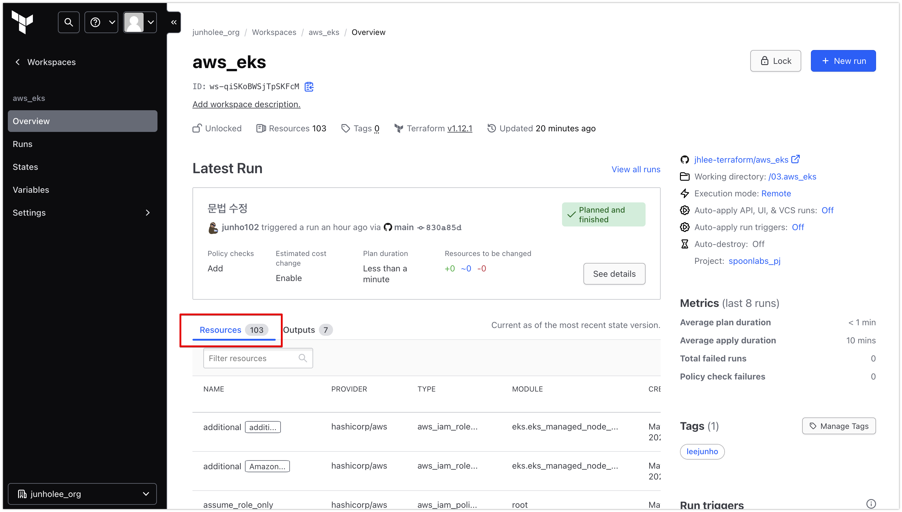
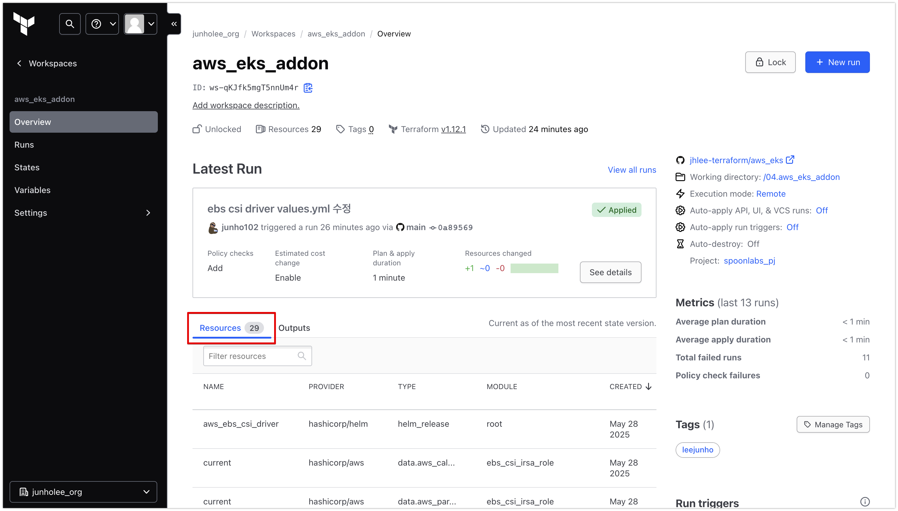
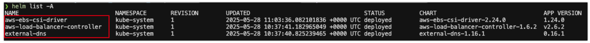

# AWS EKS 인프라 구축

## 개요

Terraform Cloud와 OIDC 기반 인증을 활용하여 AWS EKS 인프라를 코드로 안전하게 프로비저닝하는 코드입니다.
모든 인프라 코드는 디렉토리별로 역할을 분리하여 관리하며, 민감 정보는 `.gitignore`로 안전하게 관리합니다.

## 디렉토리 구조 및 역할

| 디렉토리              | 역할 요약                                                         |
|----------------------|-------------------------------------------------------------------|
| 01.aws_oidc_provider | Terraform Cloud에서 AWS 리소스 접근을 위한 OIDC Provider 및 IAM Role 생성 |
| 02.hcp_terraform     | Terraform Cloud의 Project, Workspace, VCS(GitHub) 연동 등 구조 및 자동화 관리  |
| 03.aws_eks           | 실제 AWS EKS 클러스터 및 네트워크 등 주요 인프라 리소스 생성            |
| 04.aws_eks_addon     | EKS Addon(AWS Load Balancer Controller, ExternalDNS, EBS CSI Driver) 등) 및 리소스 설치 코드                      |

---

## 1. Terraform Cloud OIDC 기반 AWS 리소스 프로비저닝 환경 세팅

Terraform Cloud를 통해 모든 AWS 리소스를 Terraform Code로 VCS(GitHub)에 관리하며, OIDC를 통해 Terraform Cloud에서 AWS IAM Role을 활용하여 AWS 리소스를 프로비저닝할 수 있도록 구성합니다.

- **AWS의 OIDC Provider 및 IAM Role 생성**과 Terraform 배포 환경인 **Terraform Cloud 환경세팅** 은 `TF코드`로 진행하며 로컬 환경에서 실행합니다. 로컬 환경에서 `terraform apply`를 실행하여 상태 파일 및 민감 정보가 로컬에만 존재합니다.
- `.gitignore`를 통해 `terraform.tfstate`, `terraform.tfvars` 등 민감 정보 및 상태 파일이 GitHub 저장소에 포함되지 않도록 안전하게 관리합니다.

**구성 흐름:**

1. [01.aws_oidc_provider](https://github.com/jhlee-terraform/aws_eks/tree/main/01.aws_oidc_provider) 에서 Terraform Cloud가 AWS의 리소스를 생성할 수 있도록 OIDC Provider 및 IAM Role을 생성합니다.

   

   

2. [02.hcp_terraform](https://github.com/jhlee-terraform/aws_eks/tree/main/02.hcp_terraform) 에서 AWS 리소스를 배포할 수 있도록 배포 환경인 Terraform Cloud의 Project, Workspace, VCS(GitHub) 연동을 선언적으로 관리하고 세팅합니다.
   - Terraform Cloud에서 실제로 설정되는 주요 항목
      - **Project**: 인프라를 논리적으로 구분하는 단위 (예: 서비스별, 프로젝트별)
      - **Workspace**: 환경별 또는 서비스별로 IaC 실행을 분리하는 단위 (예: dev, prod, eks, eks_addon 등)

        

      - **VCS Provider**: GitHub 저장소(VCS)와 연결

        

      - **Variable Set**: Terraform Cloud에서 Variable Set을 통해 AWS로 OIDC 기반 AssumeRole이 가능하도록 설정

        

---

## 2. VPC, 네트워크 리소스 및 EKS Cluster 배포

**공식 Terraform 모듈**(`terraform-aws-modules/vpc/aws`, `terraform-aws-modules/eks/aws`)을 활용하여 VPC, 네트워크 리소스, 그리고 EKS 클러스터를 표준화된 방식으로 안전하게 배포합니다.

### 2-1) **VPC 및 네트워크 리소스 구성**

- [03.aws_eks](https://github.com/jhlee-terraform/aws_eks/tree/main/03.aws_eks/main.tf) 에서 **terraform-aws-modules/vpc/aws** 모듈을 사용하여 EKS 클러스터에 최적화된 네트워크 인프라(VPC, 서브넷, IGW, NATGW 등)를 코드로 선언적으로 관리합니다.

### 2-2) VPC 모듈의 주요 옵션 및 설정 설명

- **`public_subnets`, `private_subnets`**

  - `for`문과 `cidrsubnet` 함수를 활용해 AZ(가용영역)별로 서브넷을 자동으로 생성합니다.

  - ```hcl
    public_subnets  = [for i in range(length(local.azs)) : cidrsubnet(local.vpc_cidr, 8, i)]
    private_subnets = [for i in range(length(local.azs)) : cidrsubnet(local.vpc_cidr, 8, i + 32)]
    ```

    - 여러 AZ에 걸쳐 균등하게 서브넷을 배치하여 고가용성(HA) 및 확장성을 확보합니다.

- **서브넷 태그의 목적**
  - **`public_subnet_tags = { "kubernetes.io/role/elb" = 1 }`**
    - 퍼블릭 서브넷에 이 태그를 달면, EKS에서 Service 타입이 LoadBalancer인 경우 퍼블릭 ELB가 이 서브넷에 자동으로 생성됩니다.
  
  - **`private_subnet_tags = { "kubernetes.io/role/internal-elb" = 1, "karpenter.sh/discovery" = ... }`**
    - 프라이빗 서브넷에 이 태그를 달면, EKS에서 내부용 ELB(Internal Load Balancer) 및 Karpenter(자동 노드 스케일러)가 서브넷을 자동 인식하여 사용할 수 있습니다.

- **NAT 게이트웨이 및 DNS 지원**
  - **`enable_nat_gateway`, `one_nat_gateway_per_az`**
    - 프라이빗 서브넷에서 외부 인터넷 접근이 가능하도록 NAT 게이트웨이를 AZ별로 생성합니다.
  
  - **`enable_dns_hostnames`, `enable_dns_support`**
    - VPC 내 리소스가 DNS 이름을 사용할 수 있도록 지원합니다.

> **참고:**
>
> 본 프로젝트에서 사용하는 `terraform-aws-modules/vpc/aws` 모듈은
> `public_subnets`, `private_subnets`, 그리고 NAT 관련 옵션만 지정해주면
> 퍼블릭 서브넷은 IGW(인터넷 게이트웨이)로,
> 프라이빗 서브넷은 NAT 게이트웨이로 라우팅되는
> **표준적인 AWS 네트워크 구조**가 자동으로 프로비저닝됩니다.

### 2-3) EKS 클러스터 및 노드 그룹 배포

- [03.aws_eks](https://github.com/jhlee-terraform/aws_eks/tree/main/03.aws_eks/main.tf) 에서 **terraform-aws-modules/eks/aws** 모듈을 사용하여 EKS 클러스터, Managed Node Group(노드 그룹), 클러스터 애드온, KMS 암호화, access_entries(정책 기반 접근 제어) 등 EKS 운영에 필요한 모든 리소스를 코드로 선언적으로 관리합니다.

### 2-4) EKS 모듈의 주요 옵션 및 설정 설명

- **`cluster_endpoint_public_access`**
  - EKS 클러스터의 API 서버(Endpoint) 공개 여부를 설정합니다.

  - ```hcl
    cluster_endpoint_public_access = true
    cluster_endpoint_public_access_cidrs = ["0.0.0.0/0"]
    ```

  - 운영 환경에서는 보통 VPN 등 내부망에서만 접근하도록 false로 설정하는 것이 보안상 안전합니다.
  - true로 설정할 경우, 반드시 `cluster_endpoint_public_access_cidrs` 옵션을 통해 특정 IP 대역만 접근 가능하도록 제한해야 합니다.

- **`vpc_id, subnet_ids`, `control_plane_subnet_ids`**
  - EKS 클러스터의 컨트롤플레인(ENI)과 노드/노드그룹이 사용할 VPC 및 서브넷을 지정합니다.

  - ```hcl
    vpc_id                   = module.vpc.vpc_id
    subnet_ids               = module.vpc.private_subnets
    control_plane_subnet_ids = module.vpc.private_subnets
    ```

  - `subnet_ids`: 노드/노드그룹이 실제로 배치될 서브넷을 지정합니다. (기본적으로 컨트롤플레인 ENI도 여기에 생성)
  - `control_plane_subnet_ids`: (선택) 제어플레인 ENI를 별도의 서브넷에 분리 배치할 때 사용합니다. 이를 통해 노드/노드그룹의 서브넷 풀을 확장하거나, 제어플레인 ENI와 노드 ENI의 네트워크 경계를 분리할 수 있습니다.
  - 실무적으로 대규모/고가용성 환경에서 제어플레인 ENI와 노드 ENI의 서브넷을 분리하면, 네트워크 트래픽 분리, 보안 그룹/라우팅 정책 분리 등 운영 유연성이 높아집니다.

- **`cluster_addons`**
  - EKS 클러스터에 필수 Addon(coredns, kube-proxy, vpc-cni 등)을 설치합니다.

  - ```hcl
    cluster_addons = {
      coredns = { addon_version = "v1.11.4-eksbuild.14" }
      kube-proxy = { addon_version = "v1.31.7-eksbuild.7" }
      vpc-cni = {
        addon_version = "v1.19.5-eksbuild.3"
        before_compute = true
        service_account_role_arn = module.vpc_cni_irsa.iam_role_arn
      }
    }
    ```

  - 공식 Addon을 코드로 관리하여 버전 관리, 보안 패치, 운영 자동화 가능합니다.

- **`authentication_mode`**
  - EKS 인증 모드를 지정합니다.

  - ```hcl
    authentication_mode = "API_AND_CONFIG_MAP"
    ```

  - `API_AND_CONFIG_MAP`으로 설정하면, EKS 접근 권한을 `aws-auth ConfigMap` 방식과 `AWS API(정책 기반)` 방식 모두 사용할 수 있습니다.
  - 기존 방식과 정책 기반 방식을 병행하여 점진적 전환이 가능하며, 운영 중 호환성과 유연성을 확보할 수 있습니다.
  - 실무적으로 access_entries 기반 정책 제어로 전환하는 과도기에 권장되는 설정입니다.

- **`access_entries`**
  - EKS 접근 권한을 정책 기반으로 제어합니다.

  - ```hcl
    access_entries = {
      eks_admin_access = {
        principal_arn = aws_iam_role.eks_admin_access.arn
        type = "STANDARD"
        policy_associations = {
          admin = {
            policy_arn = "arn:aws:eks::aws:cluster-access-policy/AmazonEKSClusterAdminPolicy"
            access_scope = { type = "cluster" }
          }
        }
      }
    }
    ```

  - Role별로 접근 권한을 분리하여 보안 사고를 최소화합니다.

- **`eks_managed_node_groups`**
  - EKS 관리형 노드 그룹을 선언적으로 관리합니다.

  - ```hcl
    eks_managed_node_groups = {
      addon = {
        name = "my-managed-ng"
        instance_types = ["m7i.large"]
        min_size = 2
        max_size = 2
        desired_size = 2
        subnet_ids = module.vpc.private_subnets
        create_iam_role = true
        iam_role_additional_policies = {
          AmazonEC2ContainerRegistryReadOnly = "arn:aws:iam::aws:policy/AmazonEC2ContainerRegistryReadOnly"
        }
      }
    }
    ```

  - 노드 그룹별로 인스턴스 타입, 크기, IAM Role 등을 코드로 관리하여 확장성과 보안성 강화합니다.

- **create_kms_key / cluster_encryption_config**
  - KMS 기반 시크릿 암호화 설정

  - ```hcl
    create_kms_key = true
    cluster_encryption_config = {
      resources = ["secrets"]
    }
    ```

  - 클러스터 내 민감 정보(Secret 등) 암호화로 보안성을 강화합니다.

### 2-5) Terraform Cloud를 통한 AWS 리소스 프로비저닝

- 

---

## 3. EKS Addon(Helm) 리소스 배포

공식 Helm Chart와 Terraform Helm provider를 활용하여 EKS 클러스터에 주요 Addon(Load Balancer Controller, ExternalDNS, EBS CSI Driver, EFS CSI Driver 등)을 정책 기반 IAM Role(IRSA)과 함께 안전하게 배포합니다.

### 3-1) IRSA 기반 Addon용 IAM Role 자동화

- [04.aws_eks_addon](https://github.com/jhlee-terraform/aws_eks/tree/main/03.aws_eks_addon/main.tf)에서 **terraform-aws-modules/iam/aws//modules/iam-role-for-service-accounts-eks** 모듈을 활용해 각 Addon별로 필요한 IAM Role을 IRSA 방식으로 자동 생성합니다.

### 3-2) Helm provider 기반 Addon 배포

- 공식 Helm provider와 templatefile을 활용해 각 Addon의 values.yaml을 동적으로 생성, 실무적 옵션을 명확히 관리합니다.

#### 3-2-1) **AWS Load Balancer Controller**

- AWS Load Balancer Controller를 설치하여 Ingress/Service 타입 LB 자동화 설정이 가능합니다.

- **주요 옵션**
  - `serviceAccount.annotations.eks.amazonaws.com/role-arn`: IRSA로 연결된 IAM Role
  - `clusterName`: EKS 클러스터 이름
  - `vpcId`: 클러스터 VPC ID (IMDS 차단 환경 대응)

- **예시 values.yaml**

  ```yaml
  serviceAccount:
    create: true
    name: aws-load-balancer-controller
    annotations:
      eks.amazonaws.com/role-arn: ${load_balancer_controller_role_arn}
  clusterName: ${eks_cluster_name}
  vpcId: ${vpc_id}
  ```

#### 3-2-2) **ExternalDNS**

- ExternalDNS를 설치하여 도메인 자동 등록/삭제 가 가능합니다.

- **주요 옵션**
  - `serviceAccount.annotations.eks.amazonaws.com/role-arn`: IRSA로 연결된 IAM Role
  - `txtOwnerId`: Route53 Hosted Zone ID
  - `domainFilters`: 관리할 도메인 리스트(배열)
  - `provider.name`: "aws"
  
- **예시 values.yaml**

  ```yaml
  serviceAccount:
    create: true
    name: external-dns
    annotations:
      eks.amazonaws.com/role-arn: ${external_dns_role_arn}
  txtOwnerId: ${txtOwnerId}
  domainFilters: [${domainFilters}]
  provider:
    name: aws
  ```

#### 3-2-2) **EBS CSI Driver**

- **주요 옵션**
  - `controller.serviceAccount.annotations.eks.amazonaws.com/role-arn`: IRSA로 연결된 IAM Role
  - `controller.region`: 클러스터 리전
  - `storageClasses`: gp3 등 스토리지 클래스 자동 생성

- **예시 values.yaml**

  ```yaml
  controller:
    region: ap-northeast-2
    serviceAccount:
      create: true
      name: ebs-csi-controller-sa
      annotations:
        eks.amazonaws.com/role-arn: ${ebs-csi-controller-role-arn}
  storageClasses:
    - name: gp3
      annotations:
        storageclass.kubernetes.io/is-default-class: "true"
      parameters:
        type: gp3
        csi.storage.k8s.io/fstype: ext4
  ```

> **참고:**
> IRSA + Helm provider + templatefile 조합으로 Addon별 `IAM Role`, `ServiceAccount`, `values.yaml`, `Helm Chart 배포`를 코드로 일관성 있게 관리합니다.
> 모든 Addon은 최소 권한 원칙, OIDC 기반 정책 제어, 실무적 네이밍/태깅을 적용합니다.
> `values.yaml` 템플릿화로 환경별 옵션(도메인, VPC, 리전 등) 자동 주입합니다.

### 3-3) Terraform Cloud를 통한 AWS Add-On 리소스 프로비저닝

- 

### 3-3) Helm list 확인

- 